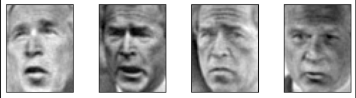
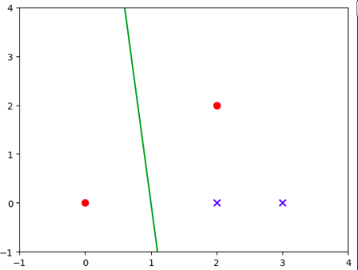
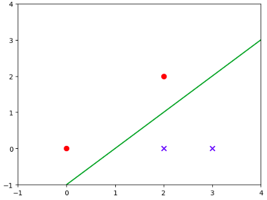
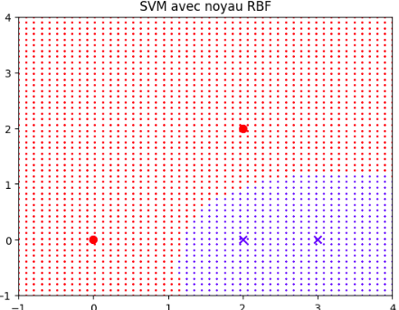
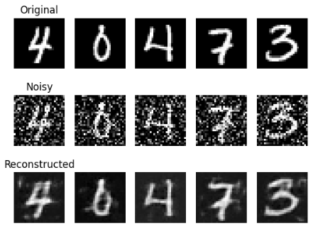
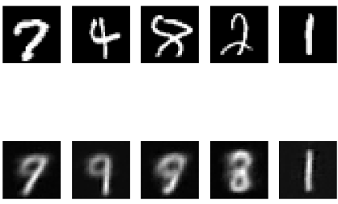

# machine_learning_basics

This repository contains the code for the machine learning basics course.

## Notebook1 : classification using PCA and kNN

Original data:

rebuilt from PCA:

## Notebook2 : classification using SVM

- without svm

- with svm

With kernel:

## Notebook3 : CNN and Variational Autoencoder

### Encoder Decoder Architecture

### Variational Encoder Decoder Architecture

